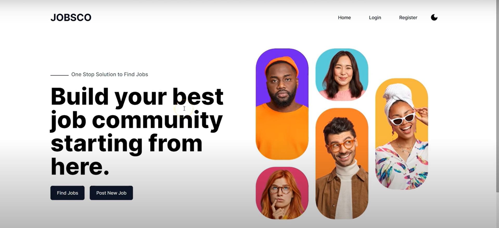
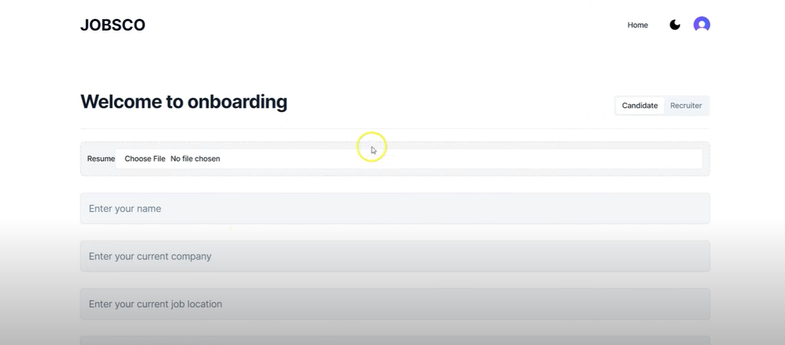
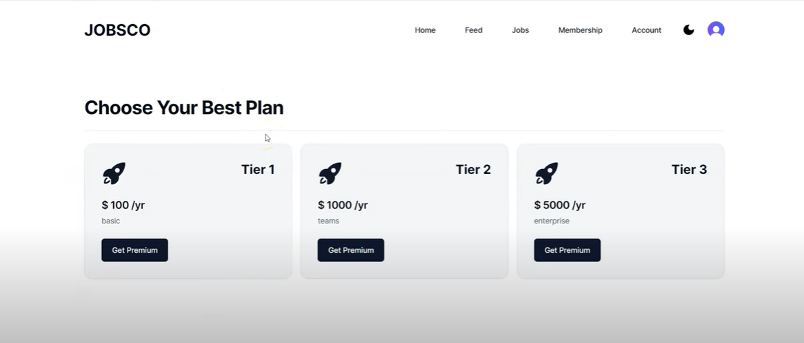
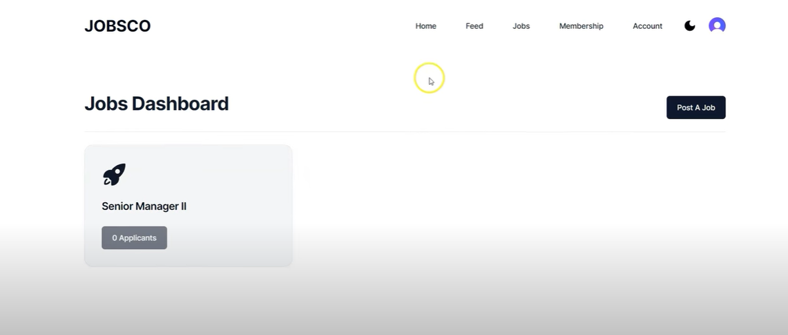
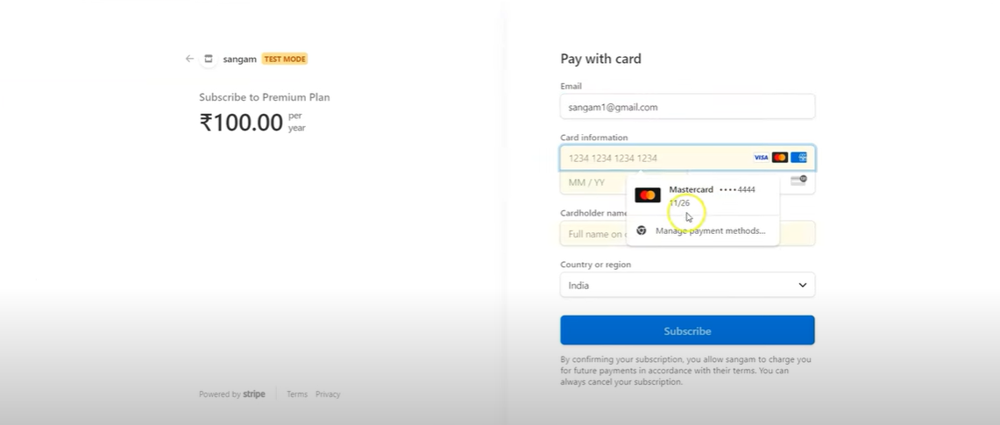
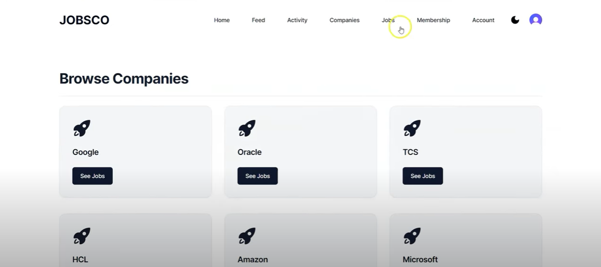

# Job Board


## Overview

A job board platform that connects job seekers with employers. The platform allows users to browse job listings, apply for positions, and manage their applications. Admins can post and manage job listings, while users can create profiles, save jobs, and track their applications. Built with Next.js, Stripe for payments, and Supabase for backend services.

## Features

- Job Listings with Filters and Sorting
- Job Application System
- User Profiles and Resume Management
- Admin Dashboard to Manage Job Postings
- Real-time Notifications with Toasts
- Payment Integration with Stripe for Premium Listings
- Theme Support with `next-themes`
- Responsive Design for Desktop and Mobile

## Technologies

- **Frontend:** Next.js, Tailwind CSS, Radix UI, React
- **Backend:** Supabase, Mongoose (for MongoDB integration)
- **Payment Integration:** Stripe
- **Utilities:** clsx, lucide-react, query-string
- **Authentication:** Clerk.js for secure user authentication
- **Development Tools:** PostCSS, TailwindCSS Animate

## Project Screenshots

Here are some screenshots of the project, which can be found in the `demo` folder:








## Installation

1. **Clone the Repository**

   ```bash
   git clone https://github.com/yourusername/job-board.git
